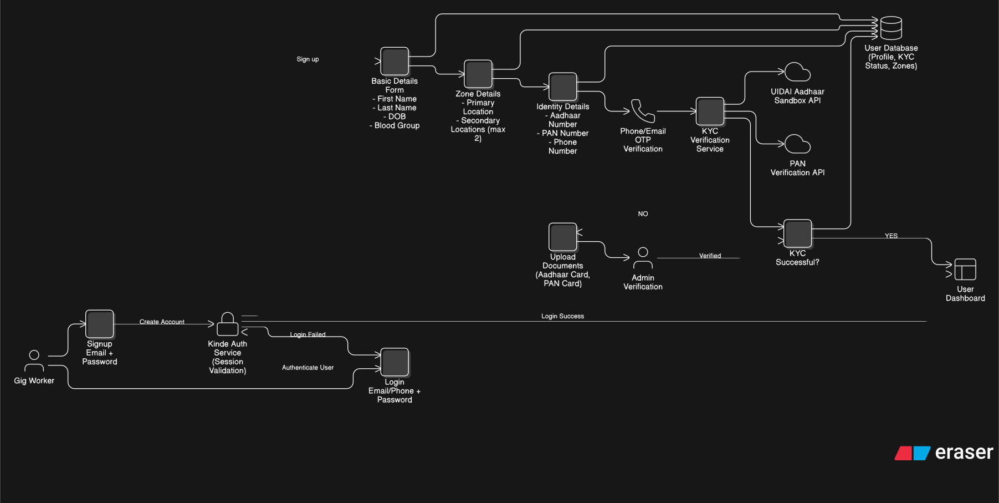
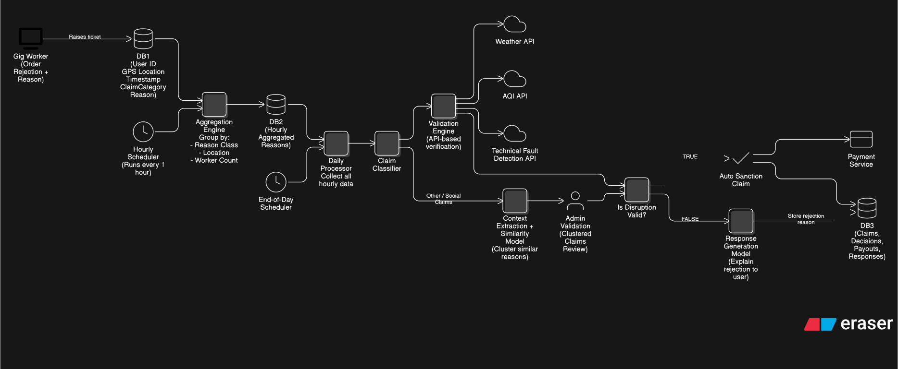
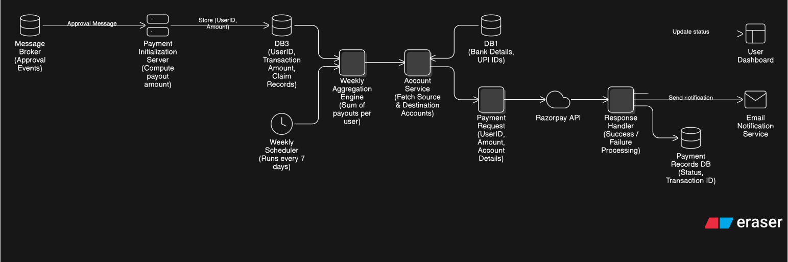

# Be Assured: AI-Powered Parametric Insurance for Gig Workers

## 1. Problem Statement

&emsp;India ranks as the second largest gig economy globally. As of 2026, approximately 5.2 million gig workers are active in the e-commerce and quick-commerce industry. Nearly 40% earn less than ₹15,000 monthly. Classified as platform partners rather than employees, despite recent labour laws aimed at providing benefits, they have no access to health insurance, provident funds, or paid leave. 

&emsp;External disruptions such as extreme weather, pollution, platform outages, and civil restrictions can essentially reduce their working hours, daily earnings and have no income protection against these uncontrollable events with **no existing compensation mechanism.** 

&emsp;“Be Assured” addresses this gap by introducing an **AI-enabled parametric insurance platform** that automatically detects such disruptions, estimates income loss, and processes payouts with minimal manual intervention, ensuring a **sustainable, profit-oriented model for the insurance provider through dynamic pricing, controlled payouts, and risk-adjusted premium calculations.**

---

## 2. Scope and Assumptions

* **Persona:** Quick-commerce delivery workers across platforms (Zepto, Blinkit, Instamart, etc.), A single worker may be registered on multiple platforms simultaneously and is unified under a single identity
  
* **Coverage:** Strictly income loss due to external disruptions
  
* **Exclusions:** Health, accidents, vehicle damage, personal absence

* ## Platform Choice (PWA):

* No app store dependency
* Eliminates app store approval delays
* Cross-platform compatibility
* Feasible as the target users are already mobile-browser-literate from using UPI apps and platform partner portals in the browser.
* Works independently of delivery platform integration

### Data Collection & Communication channels:

* GPS permission mandatory for zone validation and fraud detection
* SMS used as primary communication channel (network-independent reliability)
* Push notifications as secondary channel

### Policy Cycle

* Weekly: Monday 12:00 AM – Sunday 11:59 PM IST

---

## 3. Coverage Triggers

### Environmental

* Rainfall > 50 mm / hr
* Temperature > 42°C
* AQI > 300
* Floods and cyclones (via GDACS)

### Social

* Curfews
* Strikes
* Zone closures (admin validated)

### Technical

* Platform downtime > 30 minutes/day
* Order volume drop > 50%

(Scheduled maintenance excluded; Phase 1 uses simulated signals)

---

## 4. Stakeholders

* **Admin (Insurance Provider):** Oversees financials, validates edge cases, manages zones
* **User (Gig Worker):** Enrolls, pays premiums,  receives automatic payouts when triggers fire.

---

## 5. Identity and KYC

* Aadhaar + PAN + Mobile (OTP verified)
* One user = one account across platforms

---

## 6. Enrollment Eligibility

* A Minimum of one month of active working history on any supported platform, equivalent to 22 working days, verified through declared Platform Partner ID.
  
* Weekly income thresholds:

  * ₹3,500 (Basic)
  * ₹6,000 (Standard)
  * ₹8,000 (Pro)
* Cooling period: 2 paid premiums to be completed before the first payout becomes eligible

---

## 7. Geographic Model

* Cities divided into predefined zones with risk metadata
* 1 primary + 2 secondary zones
* Zone changes take effect after a mandatory 7-day processing period to prevent pre-event gaming.(anti-fraud)

---

## 8. Temporal Model

* The policy week runs Monday 12:00 AM to Sunday 11:59 PM IST. Premium deduction occurs on the worker's selected day at 11:00 AM via autopay.
* First retry on failed deduction is after 2 hours. Second failure halts the policy and the worker is notified via SMS. Repeated payment failures reduce a platform trust score analogous to CIBIL scoring, and workers falling below a defined threshold may be suspended from enrollment.
* All weekly coverage limits, score recalculations, and expected payout derivations reset and rerun every Sunday night for the following week.

---

## 9. Policy Plan Structure

Workers select plans based on income and working hours.

* Basic (Part-time)
* Standard (Full-time)
* Pro (High activity)

Each plan defines:

* Base premium
* Coverage multiplier
* Weekly payout cap

---

## 10. Mathematical and Financial Model

### Risk Score

RS = 0.40 Zone + 0.20 Platform + 0.25 Activity + 0.15 Income

### KPI Score

Derived from acceptance rate, cancellation rate, ratings, and wait time

### Premium Calculation

P = Base × (1 + RS) × (1 − Discount)

### Coverage

* C_max = k × P
* Adjusted using Trust Score

### Claim Calculation

* Income loss estimated per disrupted duration
* Adjusted using risk and performance factors
* Final claim bounded by coverage limits

### Actuarial Model

* Base premiums derived from:

  * Expected weekly payout
  * Operating cost
  * Target margin (15%)
* Initial values use controlled assumptions, transitioning to real data post observation period

---

## 11. Claim Model

### Primary Flow (Parametric)

When a disruption is detected in a worker's registered zone, the app sends an immediate SMS and push notification alerting the worker and prompting them to raise a claim if their work was affected. The worker opens the PWA and submits a claim ticket, which takes under 30 seconds. The ticket auto-captures their GPS location and links to the active DisruptionEvent in their zone. A brief description and optional screenshot from their delivery app may be added as supporting evidence.

Upon submission the system immediately and automatically runs the full fraud detection pipeline, calculates the payout amount using the claim formula, and routes the claim based on the resulting fraud score. Claims with a clean fraud score are approved and paid within 15 minutes of ticket submission with no human involvement. Claims with elevated fraud signals enter a 24-hour admin review queue. Claims above the rejection threshold are denied automatically with a plain-language reason sent via SMS and a 72-hour appeal window.

Each claim ticket is linked to a unique DisruptionEvent ID ensuring one claim per worker per event. Exact duplicates are blocked at the database level. Near-duplicate re-submissions are caught using cosine similarity on claim feature vectors with a threshold of 0.85. Workers who did not raise a ticket for a given event receive no payout for that event, ensuring payouts are made only to workers who actively experienced and reported the disruption.
## Duplicate Claim Prevention
Each claim is tied to a unique DisruptionEvent ID, allowing only one claim per worker per event. The system checks for an existing claim with the same worker and event before processing, blocking exact duplicates at the database level.
For near-duplicate attempts (same event with slight variations), claims are compared using feature similarity (event type, zone, time, triggers). If similarity exceeds a threshold, the claim is flagged for review.
Additionally, total payouts are capped by the weekly coverage limit, ensuring no excess claims beyond the allowed amount.
** AI/ML Integration:
* Context Extraction Model
 Processes unstructured claim reasons provided by workers and converts them into structured reason classes (e.g., environmental, social, technical). This enables standardized processing and downstream aggregation.

* Similarity Clustering Model
 Groups semantically similar claims, especially from “other” or unclassified categories—into clusters using contextual similarity. This helps identify collective disruption patterns across workers.

* Response Generation Model
 Generates clear, user-friendly explanations for claim outcomes (especially rejections), improving transparency and reducing ambiguity in communication with workers.
Each claim receives a composite fraud score from 0 to 1 based on the signals above. Scores below 0.15 auto-approve. Scores from 0.15 to 0.49 route to human review with a 24-hour SLA. Scores of 0.50 and above result in rejection with a 72-hour appeal window. Scores above 0.75 trigger account suspension.

---

## 12. Termination Policy

* Policy can be resumed within 30 days
* On termination:

  * Premiums are non-refundable
  * Fixed goodwill payout (capped) issued

### Platform Shutdown Case

* One-time compensation provided
* Policy closed thereafter

---

## 13. Adversarial Defense and Anti-Spoofing

### The Threat
A coordinated syndicate of delivery workers used GPS-spoofing applications to fake their locations inside active disruption zones while remaining at home, triggering mass false payouts and draining the platform's liquidity pool. Simple GPS coordinate verification is insufficient against this attack.

### Our Defense Architecture

Our fraud detection operates across six layered signals, none of which can be simultaneously spoofed without leaving detectable contradictions.

**GPS–IP Cross-Validation**:  compares the worker's GPS-reported zone against the IP geolocation resolved from their device's backend API calls. A genuine worker caught in a Mumbai rainstorm has both their GPS and their IP resolving to Mumbai. A spoofer using a VPN or proxy will show a GPS–IP city mismatch, which is immediately flagged. Known VPN and proxy IP ranges are maintained in a continuously updated blocklist.

**Blink Detection**: analyzes consecutive GPS pings for physically impossible transitions. If a worker's implied speed between two location readings exceeds 150 km/h, the system classifies it as a blink event — a signature artifact of GPS spoofing applications that teleport coordinates rather than moving them naturally.

**Travel Feasibility Check**: verifies that movement between any two recorded locations is physically achievable within the recorded time, using straight-line distance at a maximum realistic urban speed of 40 km/h as the lower bound.

**Historical Baseline Deviation**: builds a behavioral profile for each worker during their mandatory 1-month observation period. Claims occurring outside the worker's established zone history, active hours, or movement patterns are flagged as anomalous.

**Activity Consistency Check**: cross-verifies that the worker showed genuine delivery activity in the 2 hours before the disruption. A spoofer who was never working has zero prior order activity and zero movement. A genuine stranded worker shows an abrupt drop from active delivery to stationary, which is the expected disruption pattern.

**Syndicate Cluster Detection**: identifies coordinated fraud rings at the batch level. If more than 15 claims fire for the same disruption event within 30 minutes, all are held for review. Matching device fingerprints across multiple accounts and zone enrollment spikes exceeding 3 times the 30-day average in the 72 hours before a predicted weather event trigger extended review windows for all new enrollees in that zone.

---

## 14. Adversarial Defense (Market Crash Scenario)

The system defends against coordinated GPS spoofing attacks using **multi-signal validation**, ensuring no single spoofable input determines claim eligibility. Behavioral, spatial, and temporal inconsistencies are used to identify fraud patterns, preventing large-scale liquidity drain attacks.

---

## 15. Analytics Dashboard

### Admin View

* Worker distribution
* Risk heatmaps
* Financial metrics
* Fraud monitoring
* Real-time disruption tracking

### Worker View

* Policy status
* Premium breakdown
* Risk and trust scores
* Claim history
* Alerts

---

## 16. Technology Stack

Frontend: React (PWA)
Backend: FastAPI (Python)
Payments: Razorpay (test mode), PayPal Sandbox
Weather APIs: OpenWeatherMap, Tomorrow.io, IMD
Disaster Data: GDACS
AQI: IMD / AQICN
KYC: UIDAI APIs
Geolocation: OpenStreetMap Nominatim
Database: SQLite (Phase 1), PostgreSQL (Production)
Scheduler: APScheduler

---

## 17. Future Integrations and Enhancements

Platform Integration: Future versions will integrate directly with delivery platforms as an App plugin (e.g., Zepto, Blinkit), enabling:
Verified income data
Real-time order logs
Elimination of self-declared inputs
Stronger fraud prevention

Communication Channels: Integration with WhatsApp Business API for:
Real-time disruption alerts
Claim notifications
Policy updates
EKYC verification: Face recognition via UIDAI eKYC API i
Seasonal worker coverage: that introduces a fourth plan tier specifically for workers who operate only during peak demand seasons such as Diwali, IPL season, or summer months. This tier would have a shorter minimum enrollment period of two weeks rather than one month and a higher base premium to compensate for the compressed risk assessment window.

Policy Enhancements
Dynamic policy upgrades/downgrades
Seasonal worker support
Adaptive pricing based on seasonal risk trends

Income Verification: OCR-based income verification is an interim measure planned before platform API partnerships are established. Workers would periodically upload earnings screenshots from their delivery app. A lightweight OCR pipeline extracts weekly payout figures and validates them against the worker's declared income range, providing document-backed income verification without requiring any platform cooperation.

Data and Intelligence Enhancements
Predictive disruption modeling
Personalized risk scoring
Advanced fraud graph detection

---

## 18. Real-Time Integration and Scalability

The platform will evolve into a real-time, event-driven system where external signals are continuously streamed and processed to instantly detect disruptions, identify affected workers, and trigger automated claims with minimal latency. This will be supported by a scalable microservices architecture, enabling efficient real-time processing, fraud detection, and seamless expansion across regions.

---

## System Architecture

